# Data Schema Diagram — Coffee Shop Chain POS (`final`)

> Engine: **MariaDB / InnoDB** · Charset: `utf8mb4_unicode_ci`
> 16 tables + 1 view (`v_customer_loyalty_balance`)

## Entity-Relationship Diagram

```mermaid
erDiagram
    location ||--o{ staff           : "employs"
    location ||--o{ dining_table    : "has"
    location ||--o{ orders          : "hosts"
    location ||--o{ ingredient      : "stocks"

    staff    ||--o{ orders          : "takes"
    staff    ||--o{ audit_log       : "logs"

    customer ||--o{ orders               : "places"
    customer ||--o{ loyalty_transaction  : "earns/redeems"

    menu_category ||--o{ menu_item            : "groups"
    menu_item     ||--o{ menu_item_modifier   : "offers"
    menu_item     ||--o{ order_item           : "sold as"

    modifier_group  ||--o{ modifier_option     : "contains"
    modifier_group  ||--o{ menu_item_modifier  : "attached to"
    modifier_option ||--o{ order_item_modifier : "chosen as"

    orders ||--o{ order_item          : "contains"
    orders ||--o{ payment             : "settled by"
    orders ||--o{ order_promotion     : "applies"
    orders ||--o{ loyalty_transaction : "generates"

    order_item ||--o{ order_item_modifier : "customized by"

    promotion ||--o{ order_promotion : "used in"

    location {
        int          location_id PK
        varchar      name
        text         address
        varchar      phone
    }

    staff {
        int     staff_id    PK
        int     location_id FK
        varchar name
        enum    role "Admin|StoreManager|ShiftLead|Barista"
        varchar phone
    }

    customer {
        int     customer_id    PK
        varchar name
        varchar email
        varchar phone
        int     loyalty_points "cached balance"
    }

    menu_category {
        int     category_id   PK
        varchar category_name
    }

    menu_item {
        int     item_id      PK
        int     category_id  FK
        varchar item_name
        decimal base_price
        tinyint is_available
    }

    modifier_group {
        int     group_id       PK
        varchar group_name
        enum    selection_type "single|multiple"
        tinyint is_required
    }

    modifier_option {
        int     option_id   PK
        int     group_id    FK
        varchar option_name
        decimal price_delta
    }

    menu_item_modifier {
        int item_modifier_id PK
        int item_id          FK
        int group_id         FK
    }

    dining_table {
        int  table_id     PK
        int  location_id  FK
        int  table_number
        enum status "Available|Occupied"
    }

    orders {
        int      order_id     PK
        int      location_id  FK
        int      staff_id     FK
        int      customer_id  FK "nullable = walk-in"
        int      table_id     FK "nullable = takeaway"
        enum     order_type   "dine_in|takeaway|pickup"
        datetime order_date
        enum     order_status "Pending|Preparing|Served|Paid|Cancelled"
        decimal  total_amount
    }

    order_item {
        int     order_item_id PK
        int     order_id      FK
        int     item_id       FK
        int     quantity
        decimal unit_price "price snapshot"
        decimal subtotal
    }

    order_item_modifier {
        int     oi_modifier_id      PK
        int     order_item_id       FK
        int     option_id           FK
        decimal price_delta_at_sale "snapshot"
    }

    payment {
        int      payment_id     PK
        int      order_id       FK
        enum     payment_method "Cash|Card|Mobile"
        decimal  amount_paid
        datetime payment_time
    }

    ingredient {
        int     ingredient_id       PK
        int     location_id         FK
        varchar name
        decimal stock_level
        varchar unit
        decimal low_stock_threshold
    }

    promotion {
        int     promotion_id   PK
        varchar name
        enum    discount_type "percent|fixed"
        decimal discount_value
        date    start_date
        date    end_date
        tinyint is_active
    }

    order_promotion {
        int     order_promotion_id PK
        int     order_id           FK
        int     promotion_id       FK
        decimal amount_discounted  "snapshot"
    }

    loyalty_transaction {
        int      loyalty_txn_id PK
        int      customer_id    FK
        int      order_id       FK
        int      points_change  "always positive"
        enum     txn_type "earn|redeem"
        datetime created_at
    }

    audit_log {
        int      log_id           PK
        int      staff_id         FK
        varchar  action_type
        varchar  table_affected
        int      record_id
        datetime action_timestamp
        text     details
    }
```



## Relationship Summary

| Parent | Child | Cardinality | FK | Notes |
|--------|-------|-------------|-----|-------|
| `location` | `staff` | 1 : N | `staff.location_id` | |
| `location` | `dining_table` | 1 : N | `dining_table.location_id` | |
| `location` | `orders` | 1 : N | `orders.location_id` | |
| `location` | `ingredient` | 1 : N | `ingredient.location_id` | per-branch stock |
| `staff` | `orders` | 1 : N | `orders.staff_id` | who took the order |
| `staff` | `audit_log` | 1 : N | `audit_log.staff_id` | |
| `customer` | `orders` | 1 : N | `orders.customer_id` | **nullable** (walk-in) |
| `customer` | `loyalty_transaction` | 1 : N | `loyalty_transaction.customer_id` | |
| `menu_category` | `menu_item` | 1 : N | `menu_item.category_id` | |
| `menu_item` ↔ `modifier_group` | `menu_item_modifier` | M : N | junction | unique `(item_id, group_id)` |
| `modifier_group` | `modifier_option` | 1 : N | `modifier_option.group_id` | |
| `menu_item` | `order_item` | 1 : N | `order_item.item_id` | |
| `modifier_option` | `order_item_modifier` | 1 : N | `order_item_modifier.option_id` | |
| `orders` | `order_item` | 1 : N | `order_item.order_id` | |
| `order_item` | `order_item_modifier` | 1 : N | `order_item_modifier.order_item_id` | |
| `orders` | `payment` | 1 : N | `payment.order_id` | |
| `orders` ↔ `promotion` | `order_promotion` | M : N | junction | |
| `orders` | `loyalty_transaction` | 1 : N | `loyalty_transaction.order_id` | |
| `dining_table` | `orders` | 1 : N | `orders.table_id` | **nullable** (takeaway) |

## Design Notes

- **Price integrity (snapshots):** `order_item.unit_price`, `order_item_modifier.price_delta_at_sale`, and `order_promotion.amount_discounted` capture values *at time of sale*, so later menu/promo edits never alter historical orders.
- **Loyalty ledger:** `loyalty_transaction` is append-only; `points_change` is always positive and the sign is derived from `txn_type`. `customer.loyalty_points` is a cached balance — the source of truth is the view `v_customer_loyalty_balance`, which sums the ledger.
- **Nullable order links:** `orders.customer_id` NULL = walk-in without a loyalty account; `orders.table_id` NULL = takeaway / pickup.
- **Per-branch inventory:** each `ingredient` row is one ingredient at one branch (scoped by `location_id`).

## View

```sql
v_customer_loyalty_balance
  = customer ⨝ Σ(loyalty_transaction)
    points_balance = Σ(earn:+points_change, redeem:-points_change)
```
